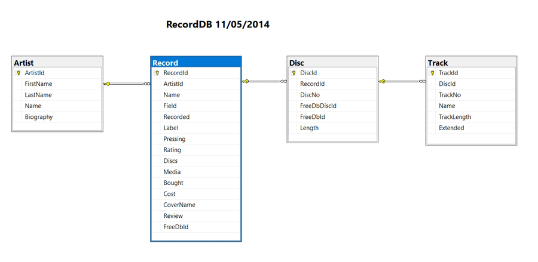
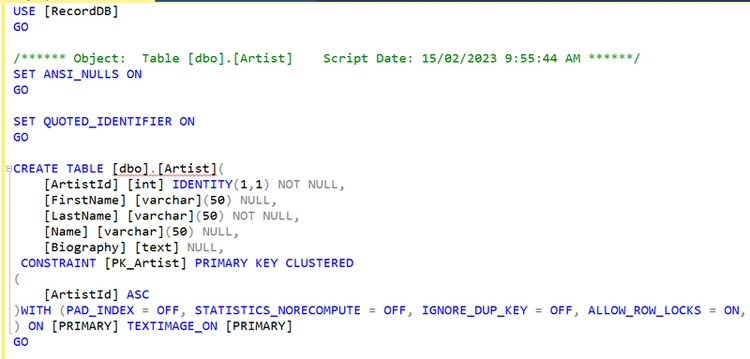
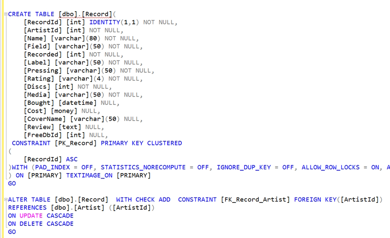

# RecordDb console application using Entity Framework

This is a .Net Core console program that is used to test methods that I have created for use in My ASP.Net core website.

This version uses SQL Server with Entity Framework and Linq to extract data from my Record database.

## Packages used

* Microsoft.EntityFrameworkCore
* Microsoft.EntityFrameworkCore.SqlServer
* Microsoft.EntityFrameworkCore.Tools
* System.Configuration.ConfigurationManager

## Database diagram

At present I have created routines for the **Artist** and **Record** tables that have a **one** Artist **to many** Records relationship.

## Artist table

## Record table

**Note:** the Artist table is denormalised with a Name field that is a concatenation of the First and Last names. I do this so I don't have to add the fields together when I am consuming data.

## Program.cs

Contains a list of the methods I am calling for testing.

## Test

This folder contains the ``ArtistTest.cs`` and ``RecordTest.cs`` files that I call from ``Program.cs``.

These methods test the Entity Framework classes that I have added to the Data folder.

## Models

This folder contains the models that Entity Framework create. I have created the ``ToString()`` methods in these models.

## Data

These are Linq queries that consume data using Entity Framework.

I have created ``ArtistData.cs`` and ``RecordData.cs`` that are called from the Test layer.

There is also a ``RecordDbContext.cs`` file that connects to the SQL Server database created by Entity Framework. For security I have added the *System.ConfigurationManager* package for the connection string and shifted the connection string call to ``App.Config``.
